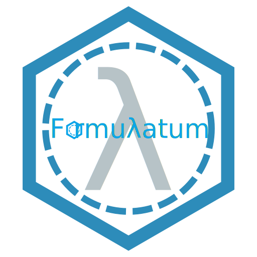

# Formulatum

<p align="center">
  
</p>

<p align="center">
  
</p>


## Introduction

A formulation chemistry tool for building formulas with chemical and regulatory 
intelligence. You can add/create chemical raw materials, defined with the 
required regulatory data. Formulas may be created/added defined by the chemicals 
used, with manufacturing instructions and finish product specifications. 
Formulas can be associated with specific conditions (i.e. no-no lists) and will 
advise the formulation chemist accordingly as they build their formulas. The 
regulatory database will link to both the chemical and formula databases 
providing real-time intelligence (perhaps this will be chance to incorporate AI).

This program will comprise of the following modules:

 - Chemicals Module
 - Formulation Module
 - Regulatory Module
 - Quality Module
 - Production Module

## Setup, Build & Test

This project will be primarily developed on Steel Bank Common Lisp (sbcl) and
Clozure CL (ccl). Plan to port/test with Clasp as that implementation is ideal
for the future of this application, but is currently not in an ideal state for \
such an endeavor.

Currently the UI system does not build successfully on Clozure CL..


## Setup

To setup this project you will first need the following system dependencies:
 - [Clozure CL](https://github.com/Clozure/ccl) and [sbcl](https://github.com/sbcl/sbcl)
 - [ocicl](https://github.com/ocicl/ocicl)


### Install Steel Bank Common Lisp (sbcl)

```bash

$ sudo dnf isntall sbcl

```


### Build/Install Clozure CL (ccl) on Fedora 42

Simply follow their instructions. CCL is the most beautiful bootstrap I've seen,
builds with everything it ships with (i.e. it's minimal lisp image kernel).

```bash
# Make installation directory and go to it
$ mkdir -p ~/.local/share/ccl/ && cd ~/.local/share/ccl/

# fetch source code into directory "ccl"
$ git clone https://github.com/Clozure/ccl.git src

# go into the "ccl" directory where the source is
$ cd src

# download pre-compiled binaries
$ curl -L -O https://github.com/Clozure/ccl/releases/download/v1.13/linuxx86.tar.gz

# unpack binaries (lisp kernel, heap image, interface database) into "ccl" 
# directory
$ tar xf ./linuxx86.tar.gz

# Rebuild CCL to make sure everything is up-to-date with respect to the current 
# sources.
$ echo '(rebuild-ccl :full t)' | ./lx86cl64 -n

# Link executable to a path your system knows
$ ln -s ./lx86cl64 ~/.local/bin/ccl
```


### Build/Install ocicl

ocicl is a modern (excellent) Common Lisp system management tool, namely,
an OCI-based ASDF system distribution and management tool for Common Lisp.

```bash
$ mkdir -p ~/.local/share/ocicl/ && cd ~/.local/share/ocicl/
$ git clone https://github.com/ocicl/ocicl.git src
$ cd ./src

$ sbcl --eval "(defconstant +dynamic-space-size+ 2048)" --load setup.lisp
```

Then set up the `ocicl` world by adding the following to your `.ccl-init.lisp`
(or `.sbclrc`):

```lisp
(ignore-errors (require 'asdf))

;;; Enable OCICL
;; Preserving existing (uiop:xdg-data-home #P"ocicl/ocicl-registry.cfg")
;; Use setup's --force option to override.

;; Present the following code to your LISP system at startup, either
;; by adding it to your implementation's startup file
;; (~/.sbclrc, ~/.ccl-init.lisp ~/.eclrc, ~/.clasprc  ~/.abclrc, ~/.clinit.cl,
;;  ~/.roswell/init.lisp)
;; or overriding it completely on the command line
;; (eg. sbcl --userinit init.lisp)

;; Note: To add other systems not registered in ocicl, simply use the
;; :tree keyword (as opposed to the default :directory) as follows. Also,
;; I wrap this initializing with `ignore-errors` so that the CL implementation
;; fails quietly...

#-ocicl
(ignore-errors
  (when (probe-file (uiop:xdg-data-home #P"ocicl/ocicl-runtime.lisp"))
    (load (uiop:xdg-data-home #P"ocicl/ocicl-runtime.lisp")))
  (asdf:initialize-source-registry
   (list :source-registry
         (list :tree (uiop:getcwd)) :inherit-configuration)))
```


### Build, Test, and Make:

Start the lisp repl

```bash
$ cd /path/to/formulatum/
$ ccl  # or sbcl
```

And load the `:formulatum` (or alias `:frml`) system and voila, `ocicl` will
pull all required CL systems that `:formulatum` depends on.

```lisp
? (asdf:load-system :frml) ; system short alias
;; or
;; (asdf:load-system :formulatum)
;;...

? (asdf:test-system :frml)
;; or
;; (asdf:test-system :formulatum)
;;...
```

And to create an executable of the `:formulatum` (aka `:frml`) system:

```lisp
? (asdf:make :frml)
;; or
;; (asdf:test-system :formulatum)
;;...
```

Note: You can always view explicitly all the system installed by ocicl via
`ocicl tree --depth=4`.


### Play & Learn

Planning to connect to lem, using micros, so that I can tweak and play with
the lisp image in realtime... Goes w/o saying, but adding slynk to connect
to good, old faithful Emacs...


## TODO Roadmap

 - [ ] Build base utilities system
 - [ ] Chemical/Raw Material database
 - [ ] Formula database
 - [ ] Regulatory database
 - [ ] Formula Editor/Builder Tool
 - [ ] Inital UI/X API development trial gtk4
   - [cl-cffi-gtk4 Bindings](https://github.com/crategus/cl-cffi-gtk4)


## References:

 - [Novaspec Common Lisp Specification](https://novaspec.org/cl/)
 - TBD
