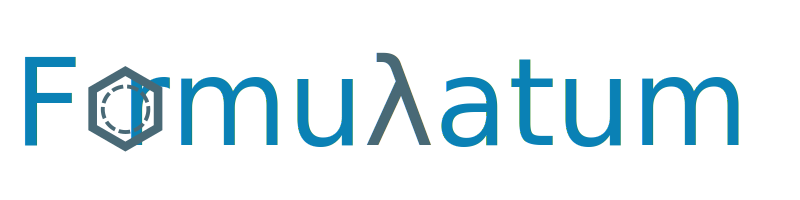
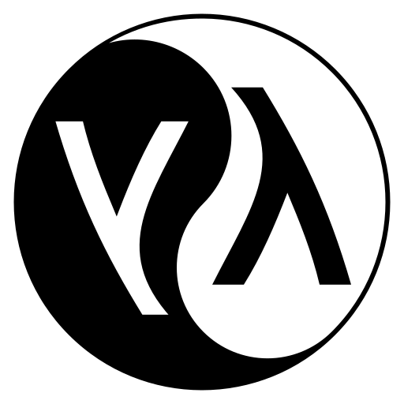

# Formulatum

<p align="center">
  
</p>

<p align="center">
  
</p>

## Setup, Building & Testing

This project will be developed on Clozure CL (ccl) and distributed under Steel Bank CL (sbcl).

### Build & Test:

Start the lisp repl
```bash

$ ccl
# or sbcl

```

```lisp

? (asdf:load-system :formulatum)
;; or
;; (asdf:load-system :frml) ; system short alias
;;...

? (asdf:test-system :formulatum)

```

### Play & Learn

TBD

## TODOs (Wish List)
 - TBD

## Changelog

### 0.0.1
  - Initial commit
  - Add basic project scaffold

## References:
 - TBD

